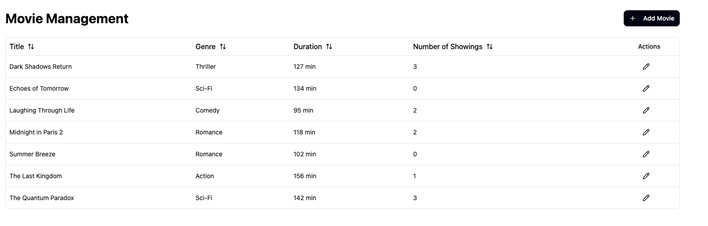
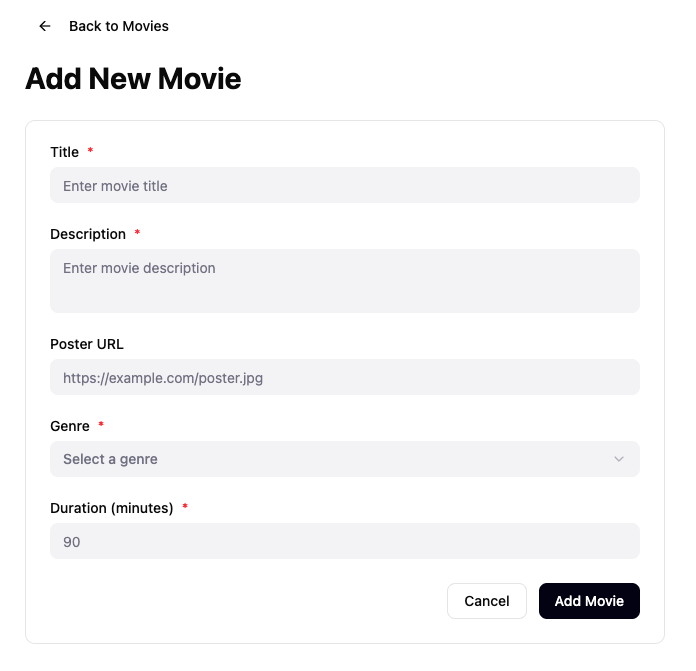
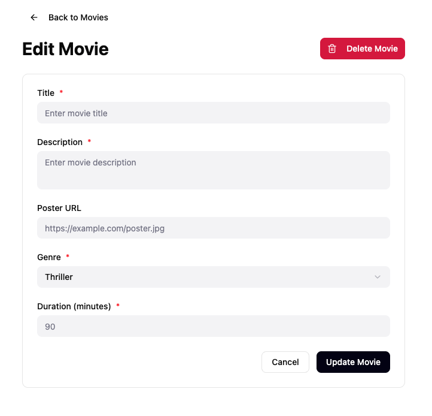
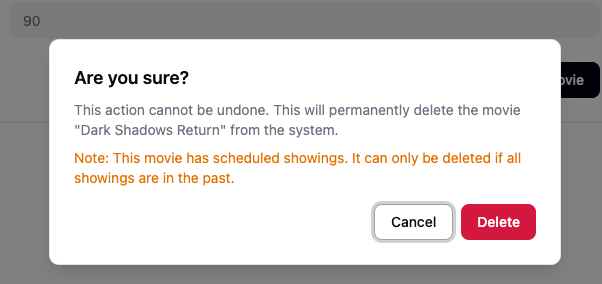

# UC003: Manage movies

As an **administrator**, I want to manage movies so that I can keep the movie catalog up to date.

## Routes

* `/admin/movies` — view the movie listing
* `/admin/movies/new` — add a new movie
* `/admin/movies/:movieId` — edit an existing movie

## Main flow

* I open the movie listing.
* I see a grid of movies showing:
  * Title
  * Genre
  * Duration
  * Number of Showings
  * Actions (edit icon)
* I can sort the grid by any column.
* I click the edit icon to navigate to the edit form for that movie.

## Add movie

* I click the "+ Add Movie" button in the listing view.
* I am taken to the add movie form view with a "Back to Movies" link at the top.
* I enter the movie details:
  * Title (required)
  * Description (required, text area)
  * Poster URL (optional)
  * Genre (required, dropdown)
  * Duration in minutes (required)
* I click "Add Movie" to save, or "Cancel" to return without saving.
* On save, I am returned to the listing where the new movie appears.

## Update movie

* I click the edit icon on a movie in the listing.
* I am taken to the edit movie form view with the current details filled in and a "Back to Movies" link at the top.
* I modify the movie details.
* I click "Update Movie" to save, or "Cancel" to return without saving.
* On save, I am returned to the listing with the updated information.

## Delete movie

* From the edit form view, I click the "Delete Movie" button (shown in red).
* A confirmation dialog appears showing the movie name and warning that this action cannot be undone.
* If the movie has scheduled showings, the dialog displays a warning note explaining it can only be deleted if all showings are in the past.
* I click "Delete" to confirm or "Cancel" to dismiss the dialog.
* After confirming, the movie is removed and I am returned to the listing.

## Business rules

* A movie that has showings in the future (today or later) cannot be deleted. The confirmation dialog shows a warning note explaining why.

## UI

* The listing view uses a sortable Grid with an "+ Add Movie" button in the top-right corner.
* Add and edit use a separate form view (not a side panel) with a "Back to Movies" navigation link.
